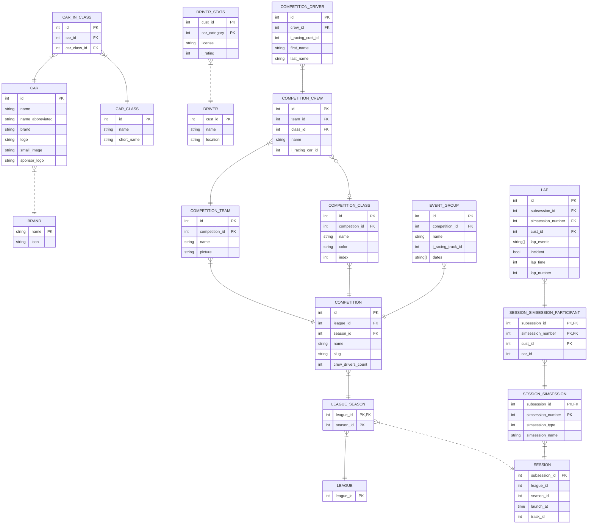

# Shared telemetry app

Shared telemetry app is a project with the goal of creating an ecosystem of useful tools for managing teams and events on the major simracing simulators.

This project is very young and started as a personal experiment, so initially there will be sporadic updates and a lot of confusion.

## Architecture

The architectural cornerstones for this project are:

- overengineering
- highly varied technologies
- chaos

Why? Because this project is about learning new things, so it is useful to complicate life.

The languages and frameworks used are:

- Sveltekit for the frontend
- Plain Go for the backend tasks
- Gin for the API

## DB schema

