# Events package

## Commands

### Leagues parser

No payload

### Season parser

Payload:

- leagueId
- seasonId

### Sessions downloader

Payload:

- subsessionId
- launchAt

## Database

## Architecture

```mermaid
sequenceDiagram
    box yellow
    participant CRON as 🕒 CRON - Every 5 minutes
    end
    box cyan
    participant PubSub1 as 📢 Topic PubSub - Trigger League Parser
    end
    box grey
    participant LeagueParser as ☁️ Cloud Run - leagues_parser
    end
    box cyan
    participant PubSub2 as 📢 Topic PubSub - Trigger Season Parser
    end
    box grey
    participant SeasonParser as ☁️ Cloud Run - season_parser
    end
    box cyan
    participant PubSub3 as 📢 Topic PubSub - Trigger Sessions Downloader
    end
    box grey
    participant SessionsDownloader as ☁️ Cloud Run - sessions_downloader
    end
    box purple
    participant DB as Database 📃
    end
    box purple
    participant IRacing as iRacing 📃
    end

    CRON->>PubSub1: Start operation

    PubSub1->>LeagueParser: Trigger 🛠
    LeagueParser->>DB: Get leagues
    DB->>LeagueParser: 
    loop Each league
        LeagueParser->>PubSub2: League id and season id
    end

    PubSub2->>SeasonParser: Trigger 🛠
    SeasonParser->>IRacing: Get sessions
    IRacing->>SeasonParser: 
    loop Each session
        SeasonParser->>PubSub3: Subsession id and date
    end

    PubSub3->>SessionsDownloader: Trigger 🛠
    SessionsDownloader->>IRacing: Get results
    IRacing->>SessionsDownloader: 
    SessionsDownloader->>DB: Store session 📄
```

